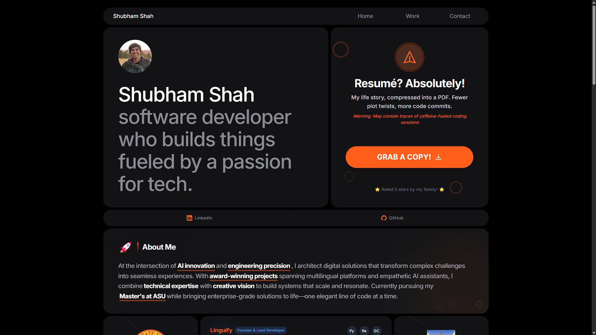

# Shubham Shah | Portfolio



A responsive and interactive portfolio website showcasing my work, skills, and experience as a software engineer.

## 🚀 Features

- **Responsive Design**: Optimized for all devices - desktop, tablet, and mobile (both portrait and landscape modes)
- **Interactive UI**: Modern bento grid layout with engaging hover effects and animations
- **Dark Mode**: Sleek dark theme for comfortable viewing
- **Project Showcase**: Detailed project cards with tech stacks and results
- **Real-time Quotes**: Rotating programming quotes to inspire visitors
- **Progress Visualization**: Visual representation of educational and professional progress
- **Seamless Navigation**: Intuitive navigation throughout the site

## 💻 Tech Stack

- React.js
- React Router for navigation
- Tailwind CSS for styling
- Framer Motion for animations
- Responsive design with custom breakpoints
- CSS Grid and Flexbox for layouts

## 🔧 Installation & Setup

1. Clone this repository
```bash
git clone https://github.com/sshah232/Shubham-Shah-Portfolio.git
cd Shubham-Shah-Portfolio
```

2. Install dependencies
```bash
npm install
```

3. Start the development server
```bash
npm run dev
```

4. Build for production
```bash
npm run build
```

## 📋 Project Structure

```
src/
├── assets/       # Images and static resources
├── components/   # React components
│   ├── FadeIn.js        # Animation wrapper
│   ├── HomeBentoGridLayout.js  # Main portfolio grid
│   ├── Navbar.js        # Navigation component
│   └── ...
├── App.js        # Main application component
├── index.js      # Entry point
└── ...
```

## 📱 Responsive Design

This portfolio is designed to be fully responsive across all device sizes:
- Desktop (1024px and above)
- Tablet (768px to 1023px)
- Mobile Portrait (below 768px)
- Mobile Landscape (below 600px height)

The landscape mode is specially optimized with:
- Adjusted grid layout
- Scrollable content containers
- Reduced text sizes and spacing
- Optimized UI elements for limited vertical space

## 🎨 Customization

Feel free to customize this portfolio template for your own use:

1. Replace project details in `HomeBentoGridLayout.js`
2. Update personal information and skills
3. Replace images in the `assets` folder
4. Modify the color scheme by updating Tailwind classes (primary accent: `#ff5e1a`)

## 🤝 Contributing

Contributions are welcome! If you'd like to contribute, please:

1. Fork the repository
2. Create a new branch (`git checkout -b feature/amazing-feature`)
3. Make your changes
4. Commit your changes (`git commit -m 'Add some amazing feature'`)
5. Push to the branch (`git push origin feature/amazing-feature`)
6. Open a Pull Request

## 📃 License

This project is licensed under the MIT License - see the [LICENSE](LICENSE) file for details.

## 🙏 Acknowledgements

- Design inspiration from modern bento grid layouts
- Tailwind CSS for the utility-first styling approach
- React.js community for the amazing tools and resources
- Special mention to Sai Pranay for the initial design concept

---

Built with ❤️ by [Shubham Shah](https://github.com/sshah232)